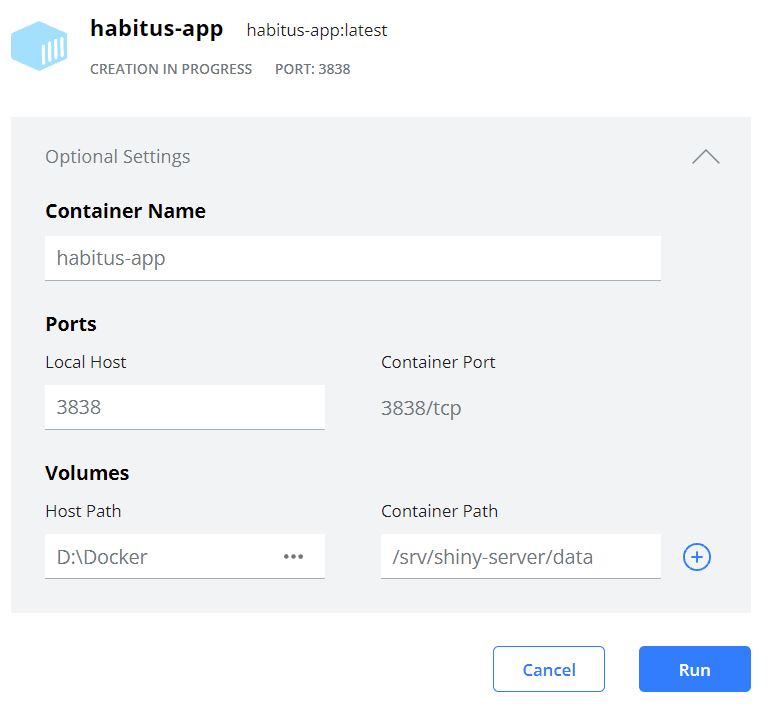

HabitusGUI is a Shiny app designed to ease processing behavioural data with research software such as GGIR, activityCounts, PALMSpy and PALMSplus. If you want to contribute to HabitusGUI then please find our contributing guidelines [here](https://github.com/wadpac/GGIR/blob/master/CONTRIBUTING.md).

## 1 Instructions for tool contributors

If you are the maintainer of a tool that has been or needs to be embedded in HabitusGUI then please see instructions   [here](https://github.com/habitus-eu/HabitusGUI/blob/main/INSTRUCTIONS_TOOL_MAINTAINERS.md).

## 2 Installation instructions

We anticipate that HabitusGUI will be installed on a server environment, where the typical user will not have to worry about the installation process as described below.

### 2.1 without Docker

This approach assumes that all HabitusGUI dependencies, such as GGIR, PALMSpy, and PALMSplus, are available in the work environment.

#### 2.1.1 Install for the first time:

1. Install R: https://cran.r-project.org/
2. Start R: `R`
3. Copy and paste to the following line to the R command line and press Enter:

```
install.package(remotes); library("remotes"); remotes::install_github("habitus-eu/HabitusGUI", dependencies=TRUE)
```

If you ever want to update the software in the future then repeat this step.

#### 2.1.2 Using HabitusGUI

1. Start R
2. In the R command line type: `library("HabitusGUI")`
3. Specify a directory that has all relevant data in it's root or sub-directories:

`data_dir = "/home/vincent/projects/fontys"`

4. Launch HabitusGUI app: `HabitusGUI::myApp(homedir=data_dir)`

### 2.2 Install with Docker

The HabitusGUI R package repository contains docker files needed for hosting Habitus Shiny app and
its dependencies.

#### 2.2.1 First time installation


1. Install docker via the official installation instructions: https://docs.docker.com/get-docker/, which are tailored to Mac, Windows and Linux. Note that Docker Desktop for Windows (and probably also Docker Desktop for Mac, but not tested yet) is not compatible with VirtualBox. If you do not know what VirtualBox is then you are probably not using it, but to be sure search your installed apps for VirtualBox. If you do have VirtualBox installed and you want to keep using it, then we recommend creating an Ubuntu Virtual Machine with VirtualBox and installing Docker inside it.

2. Create a folder on your machine and name it 'HabitusDocker', and inside it a folder named _code_.

3. Go to https://github.com/habitus-eu/HabitusGUI/blob/main/Docker/Dockerfile and right click on Raw, and then left click on `Save link as ...` Save the file to the HabitusDocker folder. The name of the file should be _Dockerfile_ without .txt extension. Alternatively, if you are familiar with Git you can also clone the entire HabitusGUI repository and copy the file.

4. Create a folder in the same directory as where you stored the _Dockerfile_ and name it 'code' without quotes.

5. Go to https://github.com/habitus-eu/HabitusGUI/blob/main/Docker/code/app.R and right click on Raw, and then left click on `Save link as...`. Save the file in the folder 'code' you use created.

6. Open command prompt

**In Windows:** Open Windows Powershell.
**In Linux:** Open Linux Command prompt.
**In Mac:** Open Terminal app.

7. cd to the folder 'HabitusDocker' folder that you just created.

Note to Linux users: You may need to configure docker to work as non-root user, see https://docs.docker.com/engine/install/linux-postinstall/
8. Type `docker build -t habitus-gui .`

This will build a Docker image with R, HabitusGUI and all it's software dependencies.

#### 2.2.2 Run the docker image

##### 2.2.2.1 In Windows via Docker Desktop for Windows:

1. Open the "Docker Desktop for Windows"
2. Go to images
3. Click run and update the optional settings as follows such that it has access to the relevant local directory.



4. Click on icon to launch in browser

##### 2.2.2.2 In Linux and Mac:

1. Open command prompt

**In Linux:** Open Linux Command prompt.
**In Mac:** Open Terminal app.

2. cd to the folder 'HabitusDocker' folder as created earlier

3. CD to the directory where the data is located.

4. Run the image and expose it to a data volume on the host:

`docker run --rm -v $PWD/:/srv/shiny-server/data/ -u shiny -p 3838:3838 habitus-gui`

5. Open app in browser: `http://localhost:3838/`


#### 2.2.4 Remove HabitusGUI image

If you would ever when to remove the image then do:

1. Open command prompt

2. `docker rmi habitus-gui`

